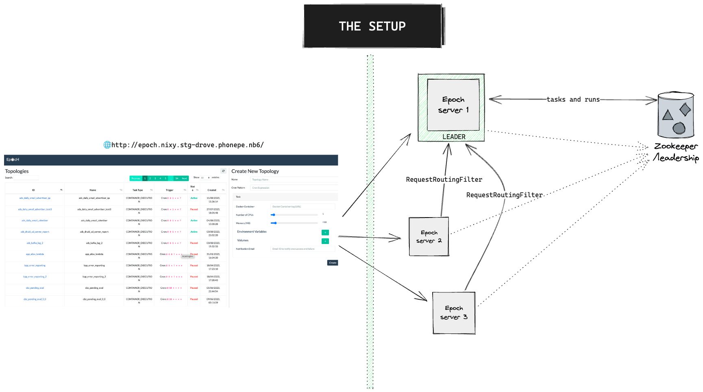
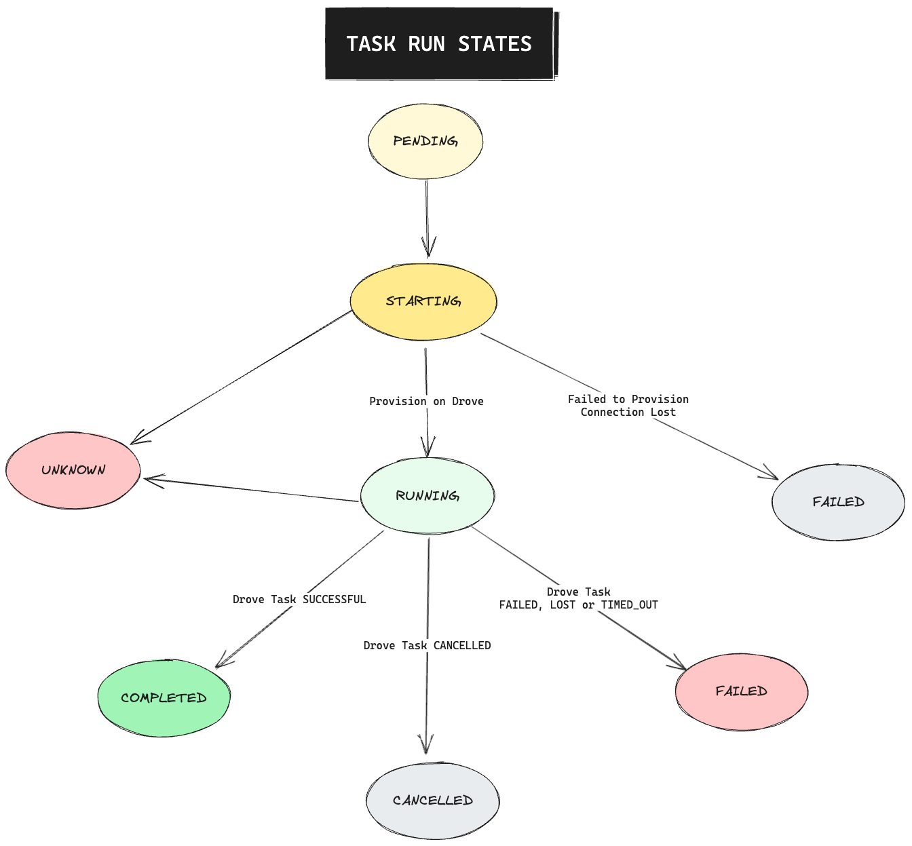
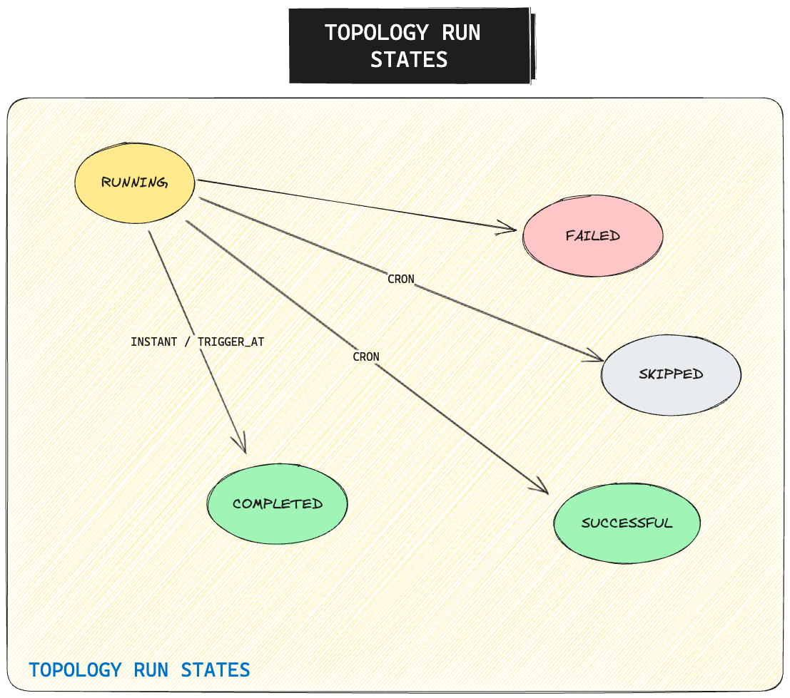
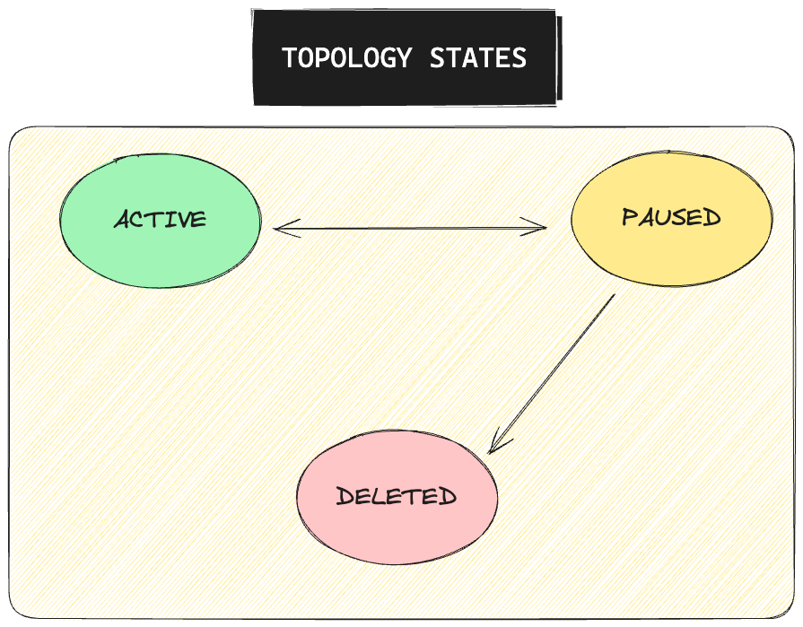
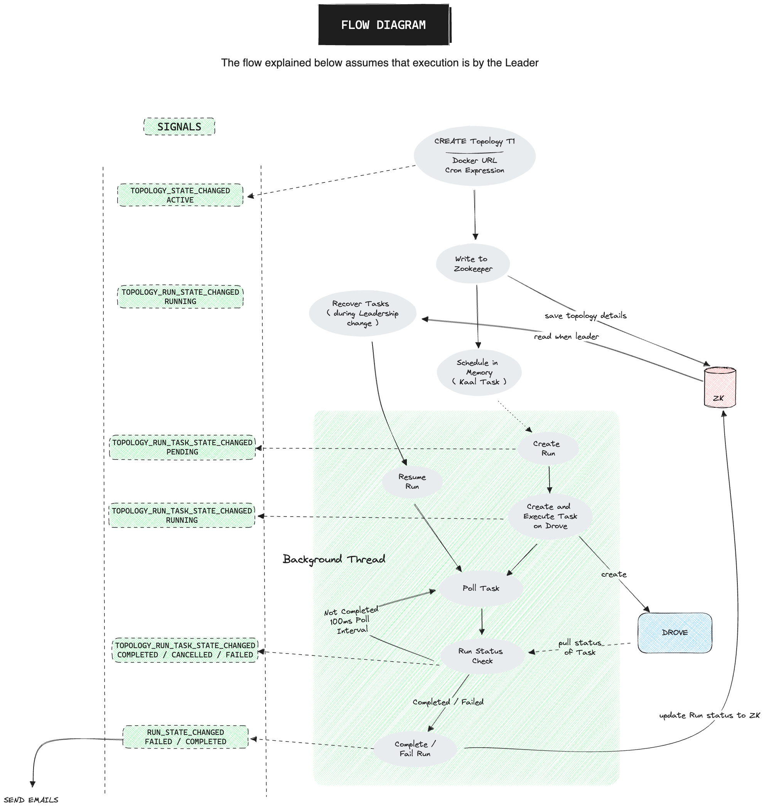
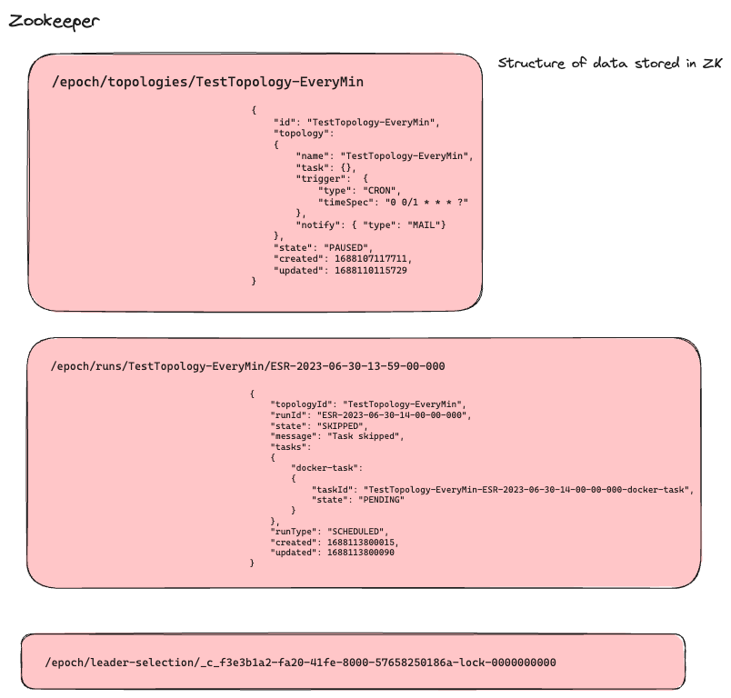

# E P O C H

The task scheduler on Drove

## Description

Epoch is task runner that allows you to run stand-alone Tasks on DROVE  
Think of it being very similar to Chronos, but on Drove and not Mesos.

## Features

- Authentication and Authorization using Olympus
- Self-serve UI for creating and managing tasks
- Ability to create a topology and schedule a recurring task
- Ability to run the above topology instantly

## Internals

### Terminology

_TASK:_ The primary unit of execution in Epoch is a Task. A task is a stand-alone unit of execution that run on
Drove.  
_TOPOLOGY:_  A topology is a definition of how the task is run - it can be scheduled to run at a particular time or at a
recurring intervals.  
- _Instant Run:_ A topology can be run instantly at a particular time
- _Scheduled Run:_ Every topology is created with a QUARTZ cron expression. This expression determines the schedule of
  the topology.  

> :warning: **Tasks On Drove**: Today, Drove only supports running tasks that are packaged as docker images. So, the
> task that you want to run on Drove should be packaged as a docker image and pushed to the Docker registry on
> PhonePe.  

> :information_source: **Quartz Cron**: Epoch uses Quartz cron expressions to schedule tasks. You can read more about
> Quartz cron expressions [here](http://www.quartz-scheduler.org/documentation/quartz-2.3.0/tutorials/crontrigger.html)

### Architecture

The first important aspect is to understand Leader Election and how requests are routed across different epoch
instances.  
A single Epoch node is the leader to all requests from the UI, and is responsible for running all Topologies/Tasks, and doing the
various state management.  
The remaining nodes route requests to the leader node.  
This is done using a simple Zookeeper based leader election, and a Routing Servlet Filter.  

##### Why did we choose to do all of this on a single leader node, isn't it less scalable ?

The actual execution of the task is done on Drove. Epoch is only responsible for managing the state of the task, and the
topology.  
So the resource intensive operation (of actually running the docker task) is outside of Epoch. Since only tracking these
tasks through a scheduler is the only thing that Epoch does, one node of epoch should scale for 10s of thousands of task
runs.
Should we need to scale this further, we can always distribute the tasks across multiple nodes.  
But until then, with the choice of not distributing, tracking all of it through a single instance is more scalable.  
Internally, Epoch uses [Kaal](https://github.com/appform-io/kaal) for scheduling the status checks and the topology runs in memory.    

A TLDR version of the request routing is represented below  

#### Understanding the various states

As explained earlier, a task is a stand-alone unit of execution.  
The following diagram shows the various states of a task. This is inline with the states of a task in Drove. 

The state of the task determines the state of a topology run. 
The following diagram shows the various states of a specific run of the Topology  

And finally, the above is only applicable if the Topology is not PAUSED. This is purely determined by the state of the
Topology, set using the UI 
The following shows the various states of a topology  

#### What does a full create flow look like?

#### Zookeeper for storing tasks, runs and topologies

Epoch uses Zookeeper to store the tasks and topologies. The following diagram shows the structure of the data in
Zookeeper

